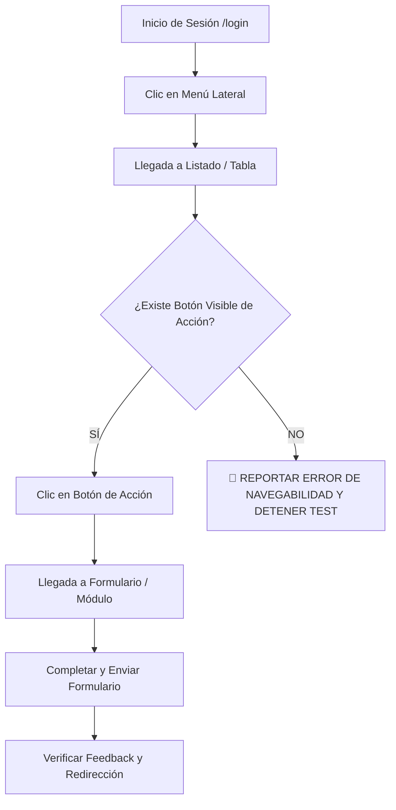

# Black-Box E2E Testing & Navigation Integrity Skill

Esta skill define el estándar obligatorio de pruebas End-to-End para asegurar que las pruebas automatizadas con Playwright simulen el comportamiento 100% real de un usuario humano, evitando atajos artificiales que oculten defectos de diseño o enlaces faltantes.

---

## 1. Regla de Oro: Prohibición de Atajos de URL en Pruebas E2E (No Direct URL Navigation)

**Queda terminantemente prohibido** en cualquier script o subagente de prueba E2E navegar directamente por URL (`goto` o `open_url`) a pantallas internas secundarias o formularios (como `/stores/{id}/qr-inventory` o `/pets/{id}/qr/link`).

### Regla Estricta:
1. El script de prueba solo puede usar URL directa para el **Login (`/login`)** o la **Landing (`/`)**.
2. **Toda navegación posterior debe realizarse exclusivamente haciendo clic en los botones, enlaces o menús visibles en la pantalla.**
3. Si un botón o enlace de navegación no existe, no es visible o no es clickeable, la prueba **DEBE FALLAR INMEDIATAMENTE (FAIL 🔴)** y reportar la ausencia del elemento en `PRDS/informe_testing/`.

---

## 2. Protocolo de Ejecución de Pruebas E2E (Coco)

---

## 3. Criterios de Aceptación para Calificar una Prueba como `APPROVED`
- [ ] La navegación desde el login hasta la acción final se completó **100% mediante clics en la interfaz gráfica**.
- [ ] Se validaron los botones de acción tanto en vista de tabla (`table-view`) como en vista de tarjetas (`cards-view`).
- [ ] Se capturaron evidencias visuales (capturas de pantalla y video WebP) mostrando la interacción real con el botón.
- [ ] Se emitió el informe correspondiente en `PRDS/informe_testing/`.
